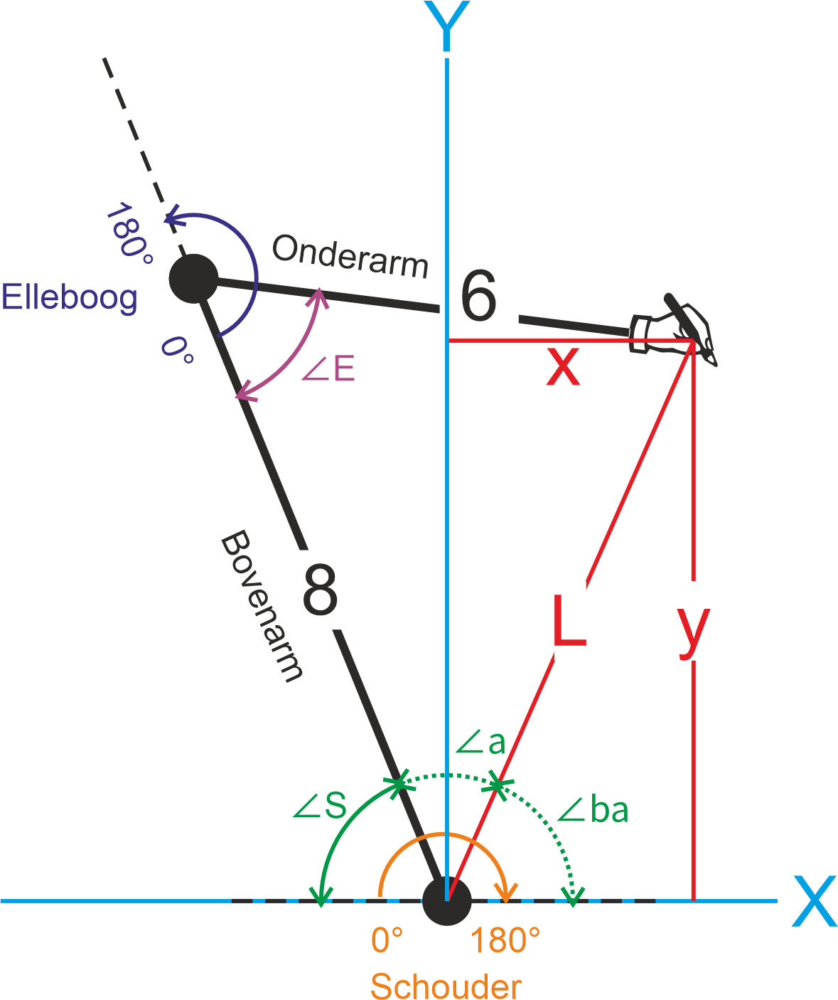
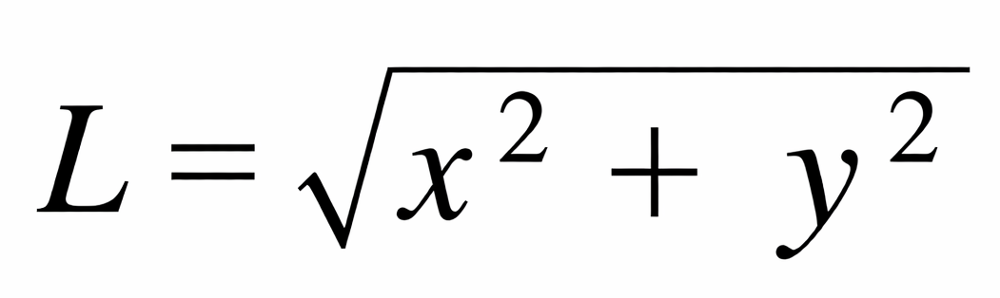
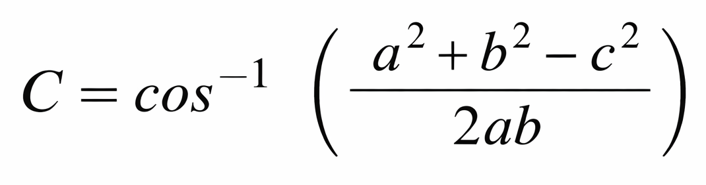
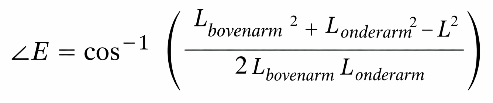

# Van hoeken naar xy coördinaten
Met de twee servo's kunnen we de pen naar ieder punt op het papier laten bewegen. Dit gaat echter in gebogen lijnen en ik wil uiteindelijk een rechte lijn kunnen tekenen. Hier komt wat goniometrie bij kijken.
Meetkundig ziet de situatie er zo uit:


* De schouderservo bevindt zich op punt (0,0) en heeft een draaibereik van 180° **rechtsom**
* De elleboogservo zit tussen de bovenarm (8 cm) en de onderarm (6cm) en heeft ook een draaibereik van 180°. Omdat deze servo op de kop is gemonteerd is de draairichting **linksom**
* De pen staat op het coördinaat (x,y)

## Uitdaging
De uitdaging is nu om een algoritme te bedenken waarmee bij een xy-coördinaat de hoek van de schouderservo **∠S** en van de elleboogservo **∠E** te bepalen.

Als eerste hebben we hiervoor de afstand **L** van de pen (x,y) tot de schouderservo (0,0) nodig. Dit kan met de **stelling van Pythagoras**:


In Python ziet dat er zo uit:

```python
import math

L = math.sqrt(x**2 + y**2)
```

Nu we **L** weten kunnen we alle hoeken bepalen. Dit gaat met de **cosinusregel**:


Met deze regel kan je iedere hoek in een driehoek bepalen als de lengtes van de drie zijden bekend zijn.
Hierboven is C de hoek die tegenover zijde c ligt.
In Python doe je dit zo:

```python
import math

a = 8
b = 8
c = 10

waarde = (a**2 + b**2 - c**2) / (2 * a * b)

hoek = math.acos(waarde)
hoek_graden = math.degrees(hoek)

print(hoek_graden)
```

Op het einde van de code worden de *hoek* (radialen) omgezet naar *hoek_graden*. 360 graden komen overeen met 2π (~6,26) radialen.

**Hoek elleboog
Als we kijken naar de elleboogservo dan zien we dat de hoek **∠E** zich in een driehoek bevindt van de bovenarm (8 cm) , onderarm (6 cm) en L. In formule vorm ziet dit er zo uit:


Als we de lengtes van de armen invullen en op de plaats van **L** de eerdere stelling van Pythagoras zetten, blijft dit over:


**Werk hier later verder aan**
