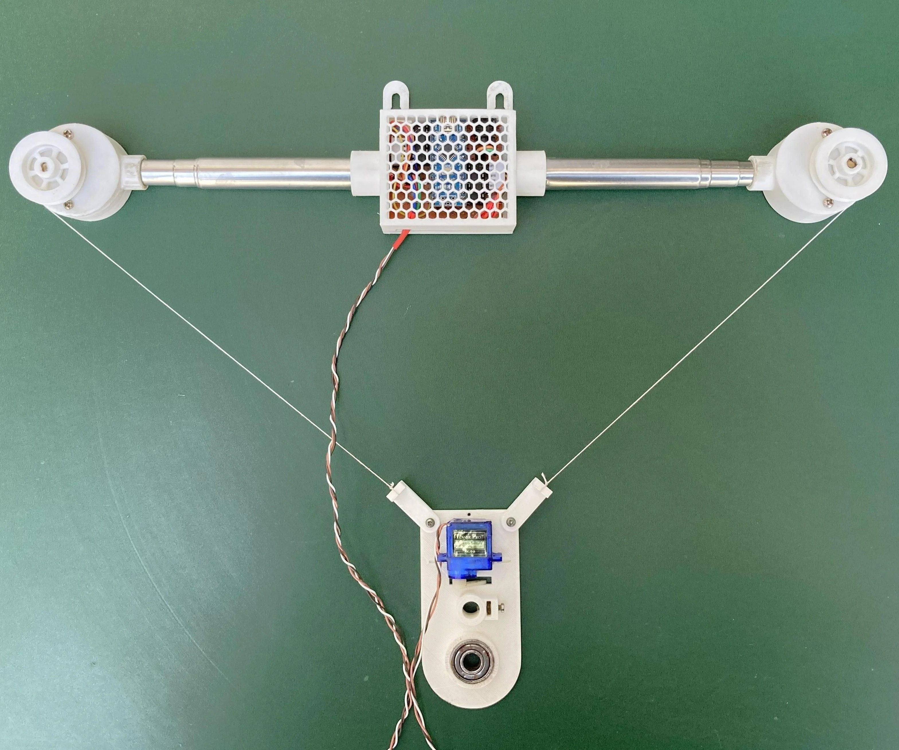

# tekenmachine\_2026

## Weer een VPC-project

Bij de clubbijeenkomst zijn er drie ideeën overgebleven voor een nieuw programmeerproject waarbij we een tekenmachine gaan maken:

1. Pantograaf (twee armen)
2. Polargraph (koordplotter)
3. Tekenkarretje ???

#### Pantograaf

* Kan worden gedaan met Arduino, Raspberry Pi Pico of micro:bit
* Kritische onderdelen zijn de drie servo's. Je kan aan de slag met de bijzonder goedkope blauwe SG90-servo's (€ 2 per stuk), maar met een servo van ongeveer € 5-10 met metalen tandwielen is het resultaat zeker beter. Voor deze eenvoudige servo's zijn geen aparte driverbordjes nodig. Wel moet je rekening houden met een aparte 5V-voeding.
* Exclusief microcontroller moet dit voor **€ 20-30** te bouwen zijn.

#### Polargraaf

* Kan worden gedaan met Arduino, Raspberry Pi Pico of micro:bit
* Hiervoor hebben twee stappenmotoren en één servo nodig. De goedkoopste stappenmotoren inclusief driver kosten € 2-5 per stuk (https://www.tinytronics.nl/nl/mechanica-en-actuatoren/motoren/stappenmotoren/stappen-motor-met-uln2003-motoraansturing). De servo hoeft hier niet van de beste kwaliteit te zijn (€ 2 per stuk). Voor een beter resultaat is een wat betere stappenmotor wel aan te bevelen. Deze kosten € 10-15 per stuk(https://www.tinytronics.nl/nl/mechanica-en-actuatoren/motoren/stappenmotoren/stappenmotor-0.14n.m-1a-nema14-jst-ph-connector), hierbij komt dan nog twee drivers van een paar Euro per stuk (https://nl.aliexpress.com/item/1005009465430336.html).
* Verder ook nog wat mechaninische onderdelen zoals zoals getande pulley's en tandriemen.
* Exclusief microcontroller dam moet dit, afhankelijk van de gekozen stappenmotoren) te bouwen zijn voor **€ 20-50**.

#### Tekenkarretje ???

Hier heb ik nog goed over nagedacht. Twee jaar geleden heb ik bij Huis73 een project gedan met een Arduino-robotkarretje. Hier heb ik nog de meeste spullen voor, maar het was achteraf gezien best wel een complex project em om enigszinds naukeurig te kunnen tekenen heb je goede motoren en wielen nodig. Ik denk dat dit te complex, te duur (minimaal € 50) en te veel voorbereidingstijd gaat kosten. Als er echter mensen zijn die de uitdaging aan willen gaan dankan dat natuurlijk altijd en er zijn ook voldoende mensen om te helpen/adviseren.

