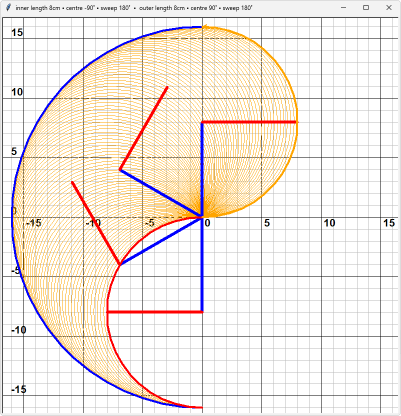
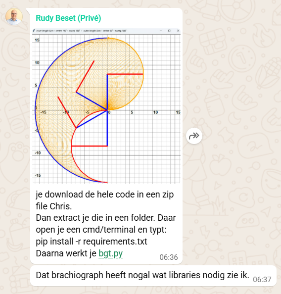
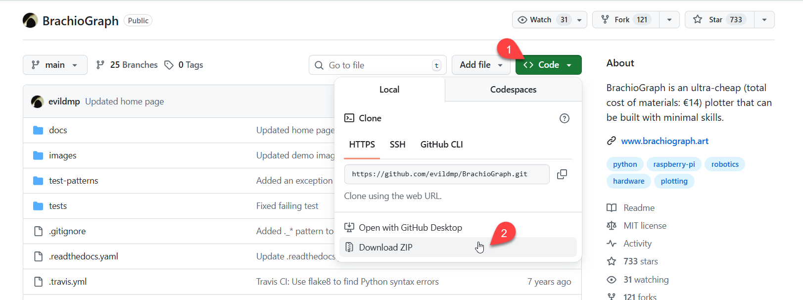

# Simulator tekenarmen

In de documentatie van het voorbeeldproject https://www.brachiograph.art/ staat een simulato waarmee je kan zien wat het tekenbereik is bij verschillende start- en draaihoeken van de tekenarmen. Deze simulatie is gebouwd in (hoe kan het anders) Python.

  

De blauwe lijn is de bovenarm
De rode lijn is de onderarm

## bgt.py
De simulatie zit volgens de documentatie in bgt.py. Dit bestand zit inderdaad in de GitHub van Brachiograph (dus **niet** de GitHub van de Vughtse Programmeer Club) die te vinden is op https://github.com/evildmp/BrachioGraph/tree/main. 
Ik heb eerst geprobeerd om het bestand te downloaden en te starten in Thonny, maar dat gaf allerlei foutmeldingen. Rudy gaf me deze tip om de simulatie toch aan de gang te krijgen:

  

Dit is echter de Linux-oplossing en ik werk op Windows. Dit zijn de stappen om het in Windows voor elkaar te krijgen. **Ik ga er vanuit dat je Python-programmeeromgeving (bijvoorbeeld Thonny) al hebt geïnstalleerd.**
### Stap 1: De Github downloaden
Ik heb voor het gemak de hele Github https://github.com/evildmp/BrachioGraph/tree/main gedownload. Dat gaat zo:

  

1. Zorg dat je in *Main* bent en ga naar [<> Code]
2. Kies hier *Download ZIP*

### Stap 2: ZIP-bestand uitpakken (ongeveer 43 Mb)
Pak het gedwonloade ZIP-bestand uit.

### Stap 3: bgt.py starten vanuit Thonny
1. Start Thonny
2. Open bgt.py
3. Start het programma

Dat ziet er zo uit:

